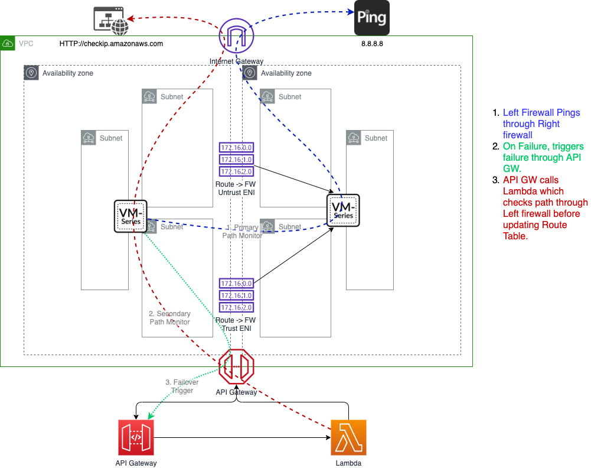
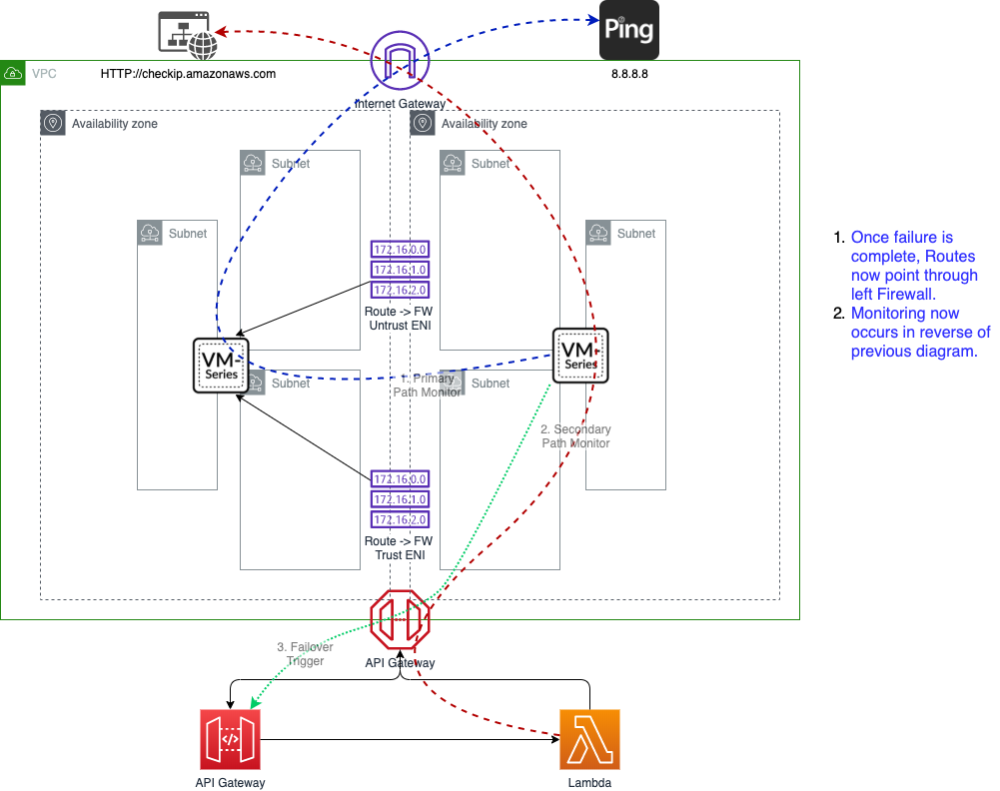

# AWS Cross Zone Fault Tolerance

## Overview
This project intends to provide the necessary components to deploy a pair of Palo Alto Networks Firewalls in 2 different Availability Zones of the same VPC.  The firewalls will then monitor each other and trigger a route table failover in the event the peer firewall is not passing traffic.  This solution overcomes the limitation of traditional HA being required to run within a given AZ.  This also avoids the long CRON timer limitation when using CloudWatch events as the trigger in similar solutions.

Common drivers for this solution are East-West routing in a [Transit Gateway Design](https://www.paloaltonetworks.com/resources/guides/aws-transit-gateway-deployment-guide) and [AWS Ingress Routing](https://live.paloaltonetworks.com/t5/Blogs/Amazon-Web-Services-AWS-Ingress-Routing/ba-p/300885).  The user can select from either the single NIC solution or the dual NIC solution.  Single NIC solutions will typically be utilized for single Zone design, for example, TGW East-West.  Dual NIC designs are typical in a two Zone, for example, Ingress Routing.

This solution assumes prior knowledge of AWS EC2, S3 and VPC constructs including Routing, Security Groups, and EIPs.  It also assumes prior Palo Alto Networks NGFW knowledge including both the CLI and Web Console.

#### Solution Flow
- The CloudFormation will deploy the following.
  + AWS::ApiGateway::Deployment
  + AWS::ApiGateway::Method
  + AWS::ApiGateway::Resource
  + AWS::ApiGateway::RestApi
  + AWS::ApiGateway::Stage
  + AWS::EC2::Instance (2 firewall instances each with 3 interfaces)
  + AWS::EC2::VPCEndpoint
  + AWS::IAM::Role
  + AWS::Lambda::Function
  + AWS::Lambda::Permission

- The firewalls utilize Path Monitoring to determine if the peer firewall is passing traffic.
  + The peer firewall destination NATs the ping probe on to 8.8.8.8 for dual NIC and the first IP of the VPC in a signle NIC design.  (Configurable)
  + The path monitor is not configured with a Preemptive Hold Timer to ensure a rapid failover.
- In the event of a path outage, the firewall utilizes Action-Oriented Log Forwarding to notify an API Gateway of the outage.
- The firewall will pass the necessary VPC and ENI information to the API Gateway.
- The API Gateway triggers a Lambda Script to initiate the failover.
- The Lambda Script first initiates an HTTP call to the firewall to validate the failover path is available.
  + The firewall destination NATs the HTTP request on to http://checkip.amazonaws.com for dual NIC and to a management profile on an loopback interface in a single NIC design. (Configurable)
- If the path check is successful, the lambda searches all route tables in the VPC and replaces the down ENIs with the live ENI.
- No automated failback occurs.  Failback can be triggered from the desired firewall by hitting the "Send Test Log" button in the Payload Format dialog box in the HTTP Server profile.

## CloudFormation Deployment
This solution is intended for retrofit into an existing VPC environment.  The following items are required to deploy the CloudFormation template.

#### Prerequisites
Download the python file corresponding to your deployment model and add it to the zip file.  Create an S3 bucket within the region and upload the newly created zip.  Make note of both the bucket and zip file name for use in the CFT deployment.

Download the YAML file corresponding to your deployment model and launch a CloudFormation template utilizing it. 

- FW0MgmtSubnet
- FW0TrustSubnet
- FW0UntrustSubnet (Dual NIC only)
- FW1MgmtSubnet
- FW1TrustSubnet
- FW1UntrustSubnet (Dual NIC only)
- FWInstanceType
- FirewallAMI [AMIs can be found here](https://docs.paloaltonetworks.com/compatibility-matrix/vm-series-firewalls/aws-cft-amazon-machine-images-ami-list) 
- KeyName
- Security Group Assigned to API Gateway and Lambda endpoints
- Zone redundant Subnets for the API Gateway and Lambda endpoints.  
  + Both endpoints reside in the same subnets.
  + Subnets should a 0.0.0.0/0 pointing to a Nat Gateway.
- S3Bucket (Used to store the lambda function code contained in a zip file)
- S3Key (Name of the zip file)
- VPCID

#### CloudFormation Outputs
The following information is outputted by the CFT for subsequent use in the firewall configuration script.

- API Gateway URL
- FW0TrustENI
- FW0UntrustENI (Dual Nic Only)
- FW1TrustENI
- FW1UntrustENI (Dual Nic Only)
- Fw0TrustIP
- Fw1TrustIP

## Firewall Configuration Deployment
This solution assumes the existence of route tables and security groups in the VPC.  Once the firewalls are deployed, the following steps should be performed.

1. Apply Security Groups to all firewall interfaces to ensure the necessary access.  
2. Apply EIPs where appropriate.
    + If managing the firewall via the internet, apply an EIP to ETH0.
    + If the firewall will route traffic to or from an IGW, apply an EIP to ETH1.  **NOTE** The health check requires internet routing from ETH1.  If an EIP is not assigned, the interface should be in a subnet that has a default route to a NAT Gateway.
3. Make note of the following items as they will be utilized in the firewall configuration.
    + +++_ VPC_ID_+++
    + +++_ VPC_CIDR_+++
    + +++_ SECOND_IP_OF_VPC_CIDR_+++
    + +++_ YOUR_API_GATEWAY_HOST__+++
    + +++_ First_IP_of_Trust_subnet_+++
    + +++_ Lambda1_CIDR_+++
    + +++_ Lambda2_CIDR_+++
    + Fw Trust IPs
    + Fw ETH1 ETH2 ENIs
4. SSH into each of the firewalls to configure them with the CLI commands found in the CLI text file corresponding to your deployment.
5. Update the appropriate route tables to point to ENIs of "primary" firewall.

## Validation
In each of the firewalls, there will be a periodic Ping from the peer firewall's trust IP to the local Trust interface that is allowed and NATed on to 8.8.8.8 for dual nic and the first IP of the Trust subnet for single NIC.  Failover can be triggered via the peer firewall by Sending a Test Log or by blocking that ping on the primary firewall. 
1. To trigger a failover, access the Device Tab, Server Profiles, HTTP.  
2. Open the AWS_HA_Down object.
3. Payload Format tab.
4. Open the System Log Type.
5. Hit the "Send Test Log" button. 
6. A dialog will open with Test Results Successfully Sent.

Access the Monitor Tab of the firewall and verify that an HTTP request has been received from either of the Lambda endpoints and successfully NATed to checkip.amazonaws.com for dual nic and to a loopback with a management profile for dual nic.

Access CloudWatch in the AWS console.  Select Logs and then Log Groups.  Open the stream /aws/lambda/<function_name>.  You can now observe the output of the Path check along with which routes and route tables were modified.

